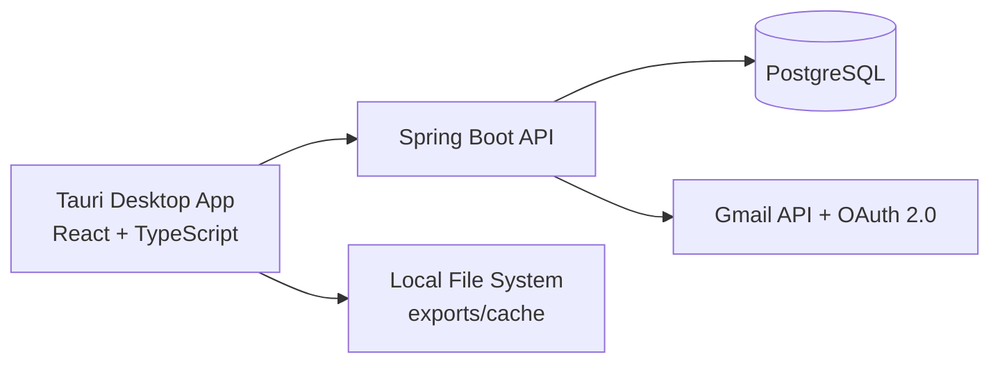

# MailPilot


MailPilot is a desktop email workspace for Gmail.  
It unifies inbox triage, action-focused followups, custom views, onboarding automation, and analytics in one local app backed by a Spring API and Postgres.

## What The App Does

- Consolidates connected Gmail accounts into one workspace
- Organizes mail with custom Views and sender/domain rules
- Runs Focus queues (`needs reply`, `overdue`, `due today`, `snoozed`, `all open`)
- Supports onboarding with account setup, profile, local app auth, and view suggestions
- Exports messages as PDF and downloads attachments
- Provides lock/login privacy with local password and recovery flow

## Architecture



## Technology Stack

| Layer | Technologies |
| --- | --- |
| Desktop app | Tauri, React, TypeScript, Vite, Tailwind, shadcn/ui, Recharts |
| Backend API | Spring Boot (Java 21), Flyway, JdbcTemplate |
| Data | PostgreSQL |
| Integrations | Gmail OAuth 2.0 + Gmail REST API |
| Dev tooling | Maven Wrapper, npm, Docker Compose, GitHub Actions |

## How MailPilot Works

1. User connects Gmail through OAuth (read-only or send-capable flow).
2. Backend stores encrypted token data and syncs Gmail metadata/messages.
3. Mailbox APIs return paginated, filterable message streams to the desktop app.
4. User processes messages in Inbox/Views/Focus; app updates followups and labels.
5. Exports and attachments are fetched on demand and saved locally via Tauri.

## APIs Used

### Internal MailPilot APIs

- `GET /api/app/state`, auth/lock/recovery under `/api/app/*`
- `POST /api/mailbox/query`, `POST /api/mailbox/query/view`
- `GET /api/messages/{id}`, body/read/seen actions under `/api/messages/*`
- `GET /api/attachments/{attachmentId}/download`
- Focus, dashboard, insights, followups under `/api/focus`, `/api/dashboard`, `/api/insights`, `/api/followups`
- Onboarding flows under `/api/onboarding/*`
- Sync and OAuth flows under `/api/sync/*`, `/api/oauth/gmail/*`

### External Google APIs

- OAuth authorize endpoint: `https://accounts.google.com/o/oauth2/v2/auth`
- OAuth token endpoint: `https://oauth2.googleapis.com/token`
- Gmail profile: `GET /gmail/v1/users/me/profile`
- Gmail messages: list/get/full (`/gmail/v1/users/me/messages`)
- Gmail history: `GET /gmail/v1/users/me/history`
- Gmail attachments: `GET /gmail/v1/users/me/messages/{messageId}/attachments/{attachmentId}`
- Gmail send: `POST /gmail/v1/users/me/messages/send`

Scopes requested by flow:

- Read flow: `gmail.readonly`
- Send flow: `gmail.readonly` + `gmail.send`

## Repository Layout

```text
MailPilot/
├─ mailpilot-desktop/    # Tauri desktop app
├─ mailpilot-server/     # Spring Boot API + sync + business logic
├─ docs/                 # Runbooks, release, security, and repo hygiene notes
├─ tools/                # Dev scripts and optional git hooks
└─ docker-compose.yml    # Local Postgres
```

## Quickstart (PowerShell)

### 1) Start database

```powershell
cd $env:USERPROFILE\Documents\MailPilot
docker compose up -d
```

### 2) Run backend

```powershell
cd $env:USERPROFILE\Documents\MailPilot\mailpilot-server
.\mvnw.cmd spring-boot:run "-Dspring-boot.run.profiles=dev"
```

Backend URL: `http://127.0.0.1:8082`

### 3) Run desktop app

```powershell
cd $env:USERPROFILE\Documents\MailPilot\mailpilot-desktop
npm ci
npm run tauri dev
```

### 4) First-use flow

1. Complete onboarding
2. Connect primary Gmail
3. Run sync
4. Open Inbox/Views/Focus

## Build And Quality Checks

Backend:

```powershell
cd $env:USERPROFILE\Documents\MailPilot\mailpilot-server
.\mvnw.cmd spotless:check
.\mvnw.cmd test
```

Desktop:

```powershell
cd $env:USERPROFILE\Documents\MailPilot\mailpilot-desktop
npm ci
npm run format:check
npm run lint:ci
npm run build
```

## Security And Secrets

Expected local secrets/config:

- `MAILPILOT_GOOGLE_OAUTH_CLIENT_JSON`
- `MAILPILOT_TOKEN_KEY_B64`

Example OAuth client JSON path:

```text
%LOCALAPPDATA%\MailPilot\google-oauth-client.json
```

Never commit:

- OAuth client secrets
- Access/refresh tokens
- Raw email payload dumps
- Secret `.env` files

## Common Troubleshooting

No messages appear after connection:

- Trigger sync from Settings
- Check `/api/sync/status`
- Confirm account is connected and not re-auth required

OAuth callback/state issues:

- Restart backend
- Reconnect via onboarding/settings
- Ensure only one active connect attempt at a time

Attachment/export save failures:

- Verify Tauri capabilities in `mailpilot-desktop/src-tauri/capabilities/default.json`
- Re-test with a known message containing attachment/PDF export path

Flyway migration errors:

- Check for duplicate migration versions
- Avoid editing already-applied migration files

## Docs

- [Server README](mailpilot-server/README.md)
- [Desktop README](mailpilot-desktop/README.md)
- [Ops Runbook](docs/ops-runbook.md)
- [Repo Hygiene](docs/repo-hygiene.md)
- [Security Notes](docs/security-notes.md)
- [Release Smoke Checklist](docs/release-smoke-checklist.md)
- [Dependency Discipline](docs/dependency-discipline.md)
- [Runtime Parity Checklist](docs/runtime-parity-checklist.md)
